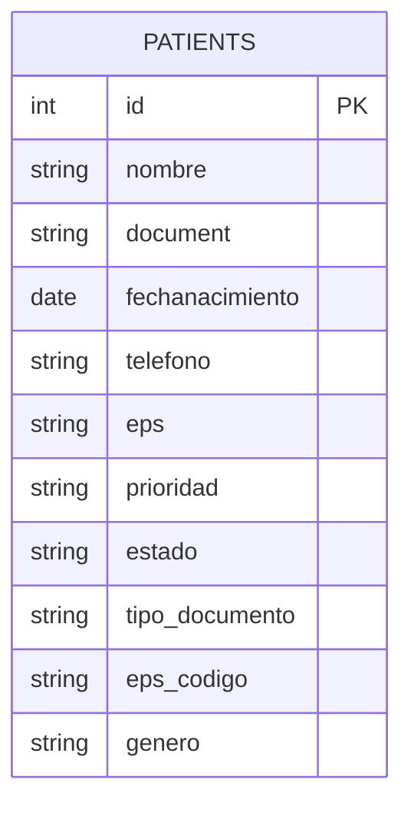

# Backend Digital Health

Este proyecto es un backend en Node.js con Express y PostgreSQL para gestionar pacientes.

## Requisitos

Antes de empezar, asegúrate de tener instalados:

- Node.js 18 o superior
- npm
- PostgreSQL
- opcionalmente: pgAdmin o psql

## 1. Instalar dependencias

Desde la carpeta del proyecto ejecuta:

```bash
npm install
```

## 2. Configurar la base de datos

1. Crea una base de datos en PostgreSQL.
2. Crea un usuario y asigna una contraseña.
3. Crea un archivo `.env` en la raíz del proyecto con las siguientes variables:

```env
DB_HOST=localhost
DB_PORT=5432
DB_USER=postgres
DB_PASSWORD=tu_contraseña
DB_NAME=digitalhealth
PORT=3000
```

> Puedes cambiar los valores según tu configuración local.

## 3. Restaurar el respaldo de la base de datos

En la raíz del proyecto existe un archivo de respaldo llamado `dump-postgres-202607141739.sql`.

Para cargarlo en tu base de datos, puedes ejecutar:

```bash
pg_restore --username=postgres --dbname=digitalhealth --clean --if-exists dump-postgres-202607141739.sql
```

Si prefieres usar PowerShell en Windows, el comando sería algo como:

```powershell
pg_restore.exe -U postgres -d digitalhealth --clean --if-exists .\dump-postgres-202607141739.sql
```

Si tu entorno no tiene `pg_restore`, puedes usar `psql` dependiendo del tipo de respaldo que tengas.

## 4. Correr el programa

Para iniciar el servidor en modo desarrollo:

```bash
npm run dev
```

O de forma normal:

```bash
npm start
```

Por defecto el servidor correrá en:

```text
http://localhost:3000
```

## 5. Probar que funciona

Puedes verificar que el backend responde en:

```text
http://localhost:3000/test
```

También expone rutas bajo:

```text
/api/patients
```

## Estructura general

- `src/app.js`: configuración de Express
- `src/server.js`: inicio del servidor
- `src/routes/`: rutas de la API
- `src/controller/`: controladores
- `src/services/`: lógica de negocio
- `src/repository/`: acceso a datos
- `src/config/db.js`: conexión con PostgreSQL

Si quieres, también puedo dejarte un archivo `.env.example` para que el proyecto sea aún más fácil de configurar.

## Diagrama de la base de datos

El backend consulta y manipula principalmente la tabla `patients`. El siguiente diagrama muestra su estructura conceptual:



> Este diagrama está basado en los campos usados por la API en el repositorio actual.
